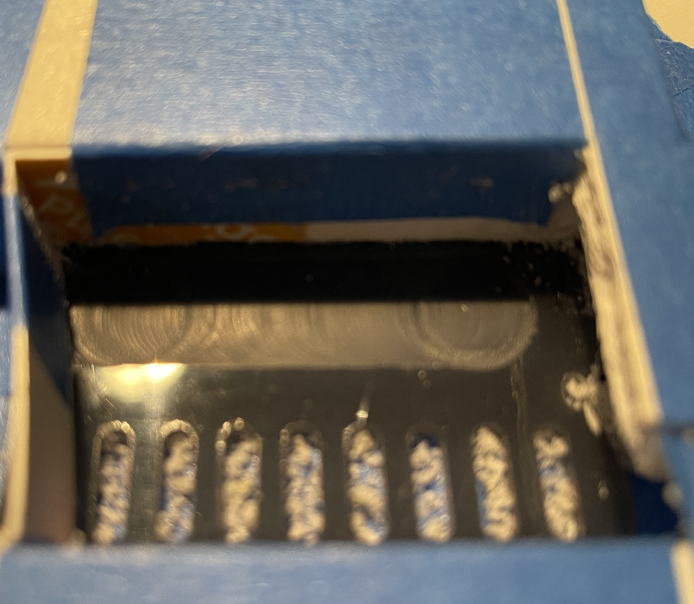
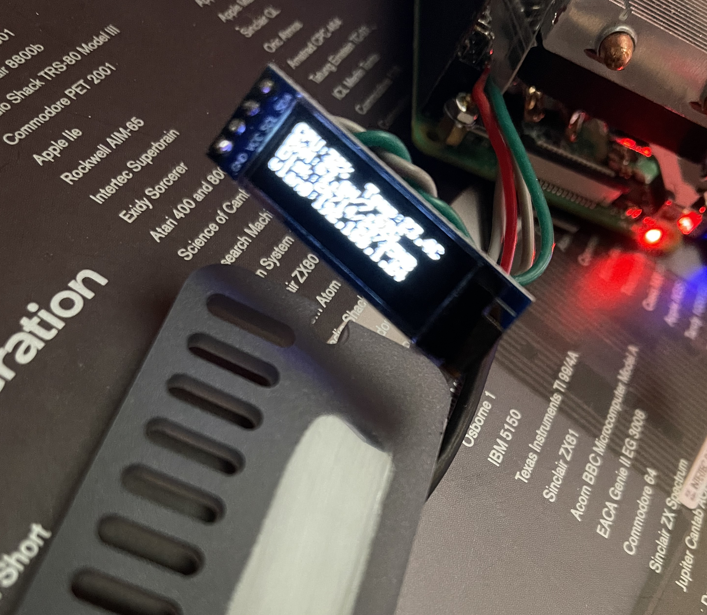

# OLEDup

DeskPi OLED And PMW Fan Controller Service

Firmware OLED and PMW Fan controller for the deskpi pi4 enclosre

The front panel of the deskpi is modified to incorporate a small 128x32 SSD1306 OLED

## The Screen

The front panel acrylic is routed and polished to incorporate the screen.

Given the acrylic is an opaque grey a small window is developed by routing out a channel on the back of the panel leaving 2mm of material. Take care not to blow through the panel, work a test piece of material adjusting the router depth until the desired transparency is obtained.

The channel is then polished to full transparency with wet and dry emery. 1000, 2000, 3000, and 7000 are used and finally polished with Meguiars Mirror Glaze

You may also polish the area in front of the routed window on the face of the panel.

Multiple layers of painters tape is used to protect areas of thepanel that should not be modified when polishing.

A hand held router was used forthis task buta cleaner approach would be to use a CNC to route the channel.

The deskpi provides an extension riser for the pi's GPIO. Solder thin flexible hookup wires to the 3V3, GND, SLA and SLC pins on the riser. There is just enough room between the riser and the CPU fan to route the wires. Hot glue can be used to secure the wires further or a simple thin plastic shim slid between the riser and the cooler.

Solder the hookup wires to the OLED and place it into the slot. Hot glue can be used to secure the screen or a strip of tape, I used a strip of self stick rubber draft excluder cut to fit the routed channel with a 2mm extra around the edge. This blocks any light bleeding from the various LED's on the Pi and the deskpi PCB and helps to cover any mishaps thatmay have occured during routng.

## The Driver

The driver controls the fan and to display system attributes, teperature, load, and atintervals the time.
Icons reflect the current temperature, fan control, and system memory and disk usage.
The OLED screen while being 128x32 px is only abut 15mm in height, icons and large fonts are used to presentinformation. A custom font was developed to display network information.

Install the driver

cd to the src folder
and execute the following
sudo bash comploy 1

# TODO

Additional modifications may be made to add a DAC to the enclosure and the screen will be extended to display audio details.
